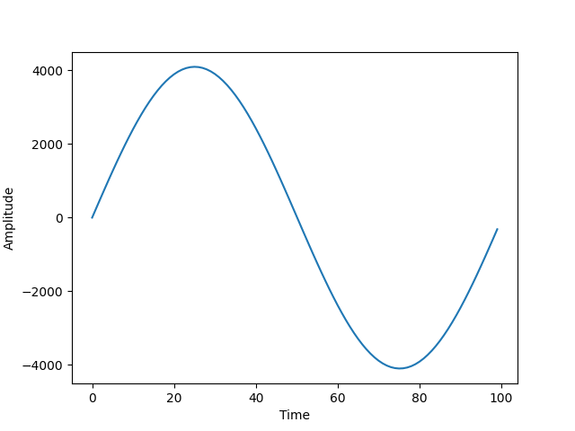

# How to Play Music Using Mathematics in Python

Implementation and understanding of [this medium](https://towardsdatascience.com/mathematics-of-music-in-python-b7d838c84f72).

- **Requirements**
    - Python (inside virtual environment)
        
        numpy
        
        matplotlib
        
        pprintpp
        
        scipy
        
    - System
        
        Mathplot requires GUI backend, so you will need to install **Tkinter**.
        

## Waves

**What is a wave ?** Interactive guide to understand a wave : 

[Let's Learn About Waveforms](https://pudding.cool/2018/02/waveforms/)

A waveform is just a schematic that helps us understand sound waves. They measure an air molecule's displacement over time. 

We can adjust the **amplitude** of a waveform to make it **louder/quieter**, and we can adjust the **frequency** of a waveform to make the **pitch higher/lower**.

Mathematically speaking, waves can be described by a wave equation like :

$g(f) = Asin(2\pi ft)$ where :

- A : amplitude (more or less *loudness*)
- f : frequency
- t : time (number of samples of audio carried per *duration*)

```python
import numpy as np
import matplotlib.pyplot as plt

samplerate = 44100

def get_wave(freq, duration=0.5):
        amplitude = 4096
        time = np.linspace(0, duration, int(samplerate * duration))
        wave = amplitude * np.sin(2 * np.pi * freq * time)

        return wave

a_wave = get_wave(440, 1)

# data visualization
print(len(a_wave))
print(np.min(a_wave))
print(np.max(a_wave))
plt.plot(a_wave[0:int(samplerate/440)])
plt.xlabel('Time')
plt.ylabel('Amplitude')
plt.show()
```

```python
#Output : waveform of a sound
44100
-4095.999685589104
4095.9996855891045
```



## Play the piano !

A piano consists of multiple octaves. An octave is a set of 12 keys, named after letters. 

Notes within an octave have a relation between each other that we can express like so :

$note\_freq = base\_freq * 2^{n/12}$

Therefore, calculating the frequency of one octave, we would be able to get the sounds of a whole piano just by changing the base frequency !

```python
def     get_piano_notes():
        octave = ['C', 'c', 'D', 'd', 'E', 'F', 'f', 'G', 'g', 'A', 'a', 'B']
        base_freq = 261.63

        note_freqs = {octave[i]: base_freq * pow(2,(i/12)) for i in range(len(octave))}
        note_freqs[''] = 0.0

        return note_freqs

note_freqs = get_piano_notes()
pp(note_freqs)
```

```python
#Output : frequency of one octave
{
    '': 0.0,
    'A': 440.00745824565865,
    'B': 493.8916728538229,
    'C': 261.63,
    'D': 293.66974569918125,
    'E': 329.63314428399565,
    'F': 349.2341510465061,
    'G': 392.0020805232462,
    'a': 466.1716632541139,
    'c': 277.18732937722245,
    'd': 311.1322574981619,
    'f': 370.00069432367286,
    'g': 415.31173722644,
}
```
